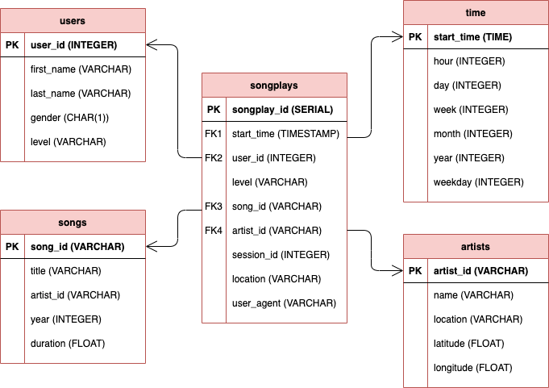

# Data Modelling with Postgres

## 1. Summary

The purpose of this repo is to create a Postgres database with tables designed to optimize queries on song play analysis. The goal is to create a database schema and ETL pipeline for this analysis.

The raw data is in two directories: a directory of JSON logs on user activity on the app, and a directory with JSON metadata on the songs. The ETL pipeline  transfers data from files in these two directories into fact and dimension tables in Postgres using Python and SQL.

## 2. Postgres Database 

Here is a [link](https://pynative.com/python-postgresql-tutorial/) to help create a Postgres database and connect to it. This is a Python PostgreSQL tutorial using Psycopg2. It demonstrates how to use the Psycopg2 module to connect to PostgreSQL and perform SQL queries, database operations.

Alternatively, you can use a Postgres docker image (available [here](https://hub.docker.com/r/onekenken/postgres-student-image)) which includes a superuser 'student' , password 'student', and database studentdb. In this case, there is no need to install Postgres as it runs in the container. 

To download the image, install docker which requires to create a username and password. In a terminal, log into docker hub (you'll be prompted for your docker username and password).

```docker login docker.io```

Pull the image

```docker pull onekenken/postgres-student-image```

Run the container

```docker run -d --name postgres-student-container -p 5432:5432 onekenken/postgres-student-image```

The create_tables.py pre-defined connection conn = psycopg2.connect("host=127.0.0.1 dbname=studentdb user=student password=student") will now connect to the container.

To stop and remove the container after the exercise

```docker stop postgres-student-container```


```docker rm postgres-student-container```

## 3. Run python scripts

To create the Postgres schema, run the following processes in order from your terminal in the root directory:

1. Create the Postgres tables with the `create_tables` python script:   
  `python create_tables.py`

2. Run the data modelling pipeline with the `etl` python script:  
  `python etl.py`

## 4. Datasets

### 4.1. Song Dataset

The first dataset is a subset of real data from the [Million Song Dataset](https://labrosa.ee.columbia.edu/millionsong/). Each file is in JSON format and contains metadata about a song and the artist of that song. The files are partitioned by the first three letters of each song's track ID. 

For example, here is the filepath to a file in this dataset: `song_data/A/A/B/TRAABJL12903CDCF1A.json`

And below is an example of what a single song file, `TRAABJL12903CDCF1A.json`, looks like.

```{"num_songs": 1, "artist_id": "ARJIE2Y1187B994AB7", "artist_latitude": null, "artist_longitude": null, "artist_location": "", "artist_name": "Line Renaud", "song_id": "SOUPIRU12A6D4FA1E1", "title": "Der Kleine Dompfaff", "duration": 152.92036, "year": 0}```

### 4.2. Log Dataset 

The second dataset consists of log files in JSON format generated by this [event simulator](https://github.com/Interana/eventsim) based on the songs in the dataset above. These simulate activity logs from a music streaming app based on specified configurations.

The log files in the dataset you'll be working with are partitioned by year and month. For example, here is the filepath to a file in this dataset:
`log_data/2018/11/2018-11-12-events.json`

## 5. Files     

1. `test.ipynb` displays the first few rows of each table to check the database.
2. `create_tables.py` drops and creates tables. Run this file to reset your tables before each time you run your ETL scripts.
3. `etl.ipynb` reads and processes a single file from `song_data` and `log_data` and loads the data into your tables. This notebook contains detailed instructions on the ETL process for each of the tables.
4. `etl.py` reads and processes files from `song_data` and `log_data` and loads them into your tables. 
5. `sql_queries.py` contains all your sql queries, and is imported into the last three files above.

## 6. Database Schema 

The star schema has one fact table (songplays), and four dimension tables (users, songs, artists, time). DROP, CREATE, INSERT, and SELECT queries are defined in `sql_queries.py`. `create_tables.py` uses functions create_database, drop_tables, and create_tables to create the database sparkifydb and the required tables.


